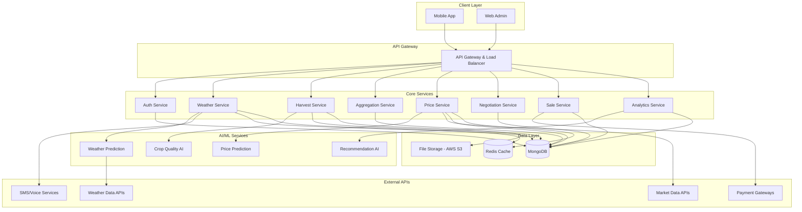

# Design Document: FARMER-ASSIST AI

## Overview

FARMER-ASSIST AI is a comprehensive agricultural platform designed to optimize crop sales through AI-driven insights. The system integrates weather forecasting, harvest planning, farmer aggregation, price prediction, pre-mandi negotiations, sale management, and post-sale analytics into a unified mobile-first platform.

The architecture follows a microservices approach with clear separation between data ingestion, AI processing, user interfaces, and external integrations. The system prioritizes reliability, scalability, and ease of use for farmers with varying technical literacy levels.

## Architecture

### High-Level Architecture



### Service Architecture Principles

1. **Microservices Design**: Each core feature is implemented as an independent Node.js service
2. **Event-Driven Communication**: Services communicate through events for loose coupling
3. **API-First Approach**: All services expose RESTful APIs with OpenAPI specifications
4. **Database Strategy**: MongoDB for document storage, Redis for caching frequently accessed data
5. **Fault Tolerance**: Circuit breakers and graceful degradation for external dependencies

## Components and Interfaces

### Core Services

#### Authentication Service
- **Purpose**: User authentication, authorization, and profile management
- **Key Functions**:
  - JWT-based authentication
  - Role-based access control (Farmer, Trader, Admin)
  - Multi-language profile preferences
  - Device registration for push notifications

#### Weather Service
- **Purpose**: Weather data ingestion, processing, and alert generation
- **Key Functions**:
  - Integration with multiple weather APIs (IMD, OpenWeather, AccuWeather)
  - 7-day forecast processing and caching
  - Severe weather alert detection
  - Voice alert generation in local languages
- **External Dependencies**: Weather data providers, Text-to-speech services

#### Harvest Service
- **Purpose**: Crop quality assessment and harvest timing recommendations
- **Key Functions**:
  - Image processing for crop quality grading
  - Harvest timing optimization algorithms
  - Crop maturity tracking
  - Quality score calculation
- **AI Integration**: Computer vision models for crop assessment

#### Aggregation Service
- **Purpose**: Farmer pooling and logistics coordination
- **Key Functions**:
  - Geographic clustering of farmers
  - Transport cost calculation and splitting
  - Aggregation opportunity matching
  - Logistics coordination
- **Algorithms**: Geospatial clustering, cost optimization

#### Price Service
- **Purpose**: Market price tracking and prediction
- **Key Functions**:
  - Multi-mandi price data collection
  - Price trend analysis and forecasting
  - Transportation cost calculation
  - Market recommendation engine
- **AI Integration**: Time series forecasting models

#### Negotiation Service
- **Purpose**: Pre-mandi bidding and price locking
- **Key Functions**:
  - Digital lot creation and management
  - Trader notification and bidding
  - Reference price locking
  - Bid comparison and recommendations

#### Sale Service
- **Purpose**: Mandi transaction management and payments
- **Key Functions**:
  - Digital lot verification at mandi
  - Transaction recording and completion
  - Payment processing integration
  - Digital receipt generation

#### Analytics Service
- **Purpose**: Performance tracking and insights generation
- **Key Functions**:
  - Income optimization calculations
  - Performance benchmarking
  - Future demand predictions
  - Recommendation generation for next season

### AI/ML Components

#### Weather Prediction Engine
- **Models**: Ensemble weather forecasting with local calibration
- **Input**: Raw meteorological data, historical patterns
- **Output**: 7-day forecasts with confidence intervals

#### Crop Quality AI
- **Models**: Convolutional Neural Networks for image classification
- **Input**: Crop photos from farmers
- **Output**: Quality grades (A, B, C) with specific feedback

#### Price Prediction Engine
- **Models**: LSTM networks for time series forecasting
- **Input**: Historical prices, weather data, seasonal patterns
- **Output**: 7-day price forecasts with accuracy metrics

#### Recommendation AI
- **Models**: Collaborative filtering and content-based recommendations
- **Input**: Farmer history, market conditions, peer performance
- **Output**: Personalized recommendations for timing, markets, crops

### Mobile Application Architecture

#### Frontend Framework
- **Technology**: React Native for cross-platform development
- **State Management**: Redux for application state
- **Offline Support**: Redux Persist with local SQLite storage
- **UI Components**: Custom component library optimized for rural users

#### Key Features
- **Simple Navigation**: Tab-based navigation with large, clear icons
- **Voice Integration**: Speech-to-text and text-to-speech capabilities
- **Offline Mode**: Critical features available without internet
- **Progressive Loading**: Graceful handling of slow network connections

## Data Models

All data models will be implemented as MongoDB documents with Mongoose schemas for validation and type safety.

### User Models

```typescript
interface Farmer {
  id: string;
  name: string;
  phoneNumber: string;
  location: GeoLocation;
  preferredLanguage: Language;
  crops: CropProfile[];
  farmSize: number; // in acres
  registrationDate: Date;
  verificationStatus: VerificationStatus;
}

interface Trader {
  id: string;
  name: string;
  phoneNumber: string;
  businessName: string;
  mandis: string[]; // mandi IDs where trader operates
  cropPreferences: CropType[];
  verificationStatus: VerificationStatus;
}
```

### Crop and Harvest Models

```typescript
interface CropProfile {
  cropType: CropType;
  variety: string;
  plantingDate: Date;
  expectedHarvestDate: Date;
  farmArea: number; // in acres
  expectedYield: number; // in quintals
}

interface CropAssessment {
  id: string;
  farmerId: string;
  cropType: CropType;
  photos: string[]; // image URLs
  qualityGrade: QualityGrade;
  qualityScore: number; // 0-100
  assessmentDate: Date;
  feedback: string[];
  recommendedHarvestDate: Date;
}

enum QualityGrade {
  PREMIUM = 'A',
  STANDARD = 'B',
  BASIC = 'C'
}
```

### Market and Pricing Models

```typescript
interface MarketPrice {
  id: string;
  mandiId: string;
  cropType: CropType;
  variety: string;
  price: number; // per quintal
  date: Date;
  volume: number; // quintals traded
  source: DataSource;
}

interface PricePrediction {
  cropType: CropType;
  mandiId: string;
  predictions: DailyPrediction[];
  confidence: number; // 0-1
  generatedAt: Date;
}

interface DailyPrediction {
  date: Date;
  predictedPrice: number;
  confidenceInterval: {
    lower: number;
    upper: number;
  };
}
```

### Aggregation Models

```typescript
interface AggregationGroup {
  id: string;
  cropType: CropType;
  targetMandi: string;
  farmers: FarmerParticipation[];
  totalQuantity: number; // quintals
  averageQuality: QualityGrade;
  transportCost: number;
  status: AggregationStatus;
  createdAt: Date;
  scheduledDate: Date;
}

interface FarmerParticipation {
  farmerId: string;
  quantity: number;
  qualityGrade: QualityGrade;
  transportShare: number; // cost allocation
}

enum AggregationStatus {
  FORMING = 'forming',
  CONFIRMED = 'confirmed',
  IN_TRANSIT = 'in_transit',
  COMPLETED = 'completed'
}
```

### Negotiation Models

```typescript
interface DigitalLot {
  id: string;
  lotNumber: string; // human-readable ID
  farmerId: string;
  aggregationId?: string; // if part of aggregation
  cropType: CropType;
  variety: string;
  quantity: number;
  qualityGrade: QualityGrade;
  photos: string[];
  reservePrice: number;
  targetMandi: string;
  status: LotStatus;
  createdAt: Date;
  expiresAt: Date;
}

interface Bid {
  id: string;
  lotId: string;
  traderId: string;
  bidPrice: number;
  quantity: number; // may be partial
  conditions: string[];
  validUntil: Date;
  status: BidStatus;
  createdAt: Date;
}

enum LotStatus {
  DRAFT = 'draft',
  PUBLISHED = 'published',
  BIDDING = 'bidding',
  SOLD = 'sold',
  EXPIRED = 'expired'
}
```

### Transaction Models

```typescript
interface Transaction {
  id: string;
  lotId: string;
  farmerId: string;
  traderId: string;
  mandiId: string;
  cropType: CropType;
  quantity: number;
  finalPrice: number;
  totalAmount: number;
  fees: TransactionFees;
  paymentMethod: PaymentMethod;
  status: TransactionStatus;
  completedAt: Date;
}

interface TransactionFees {
  platformFee: number;
  mandiFee: number;
  transportCost: number;
  otherCharges: number;
}

interface PaymentRecord {
  transactionId: string;
  amount: number;
  paymentGateway: string;
  gatewayTransactionId: string;
  status: PaymentStatus;
  processedAt: Date;
}
```

### Analytics Models

```typescript
interface FarmerAnalytics {
  farmerId: string;
  period: AnalyticsPeriod;
  totalSales: number;
  totalQuantity: number;
  averagePrice: number;
  incomeOptimization: number; // extra income through platform
  marketAccuracy: number; // prediction accuracy
  recommendations: Recommendation[];
  benchmarks: PerformanceBenchmark;
}

interface PerformanceBenchmark {
  regionalAveragePrice: number;
  performanceVsRegion: number; // percentage difference
  topPerformerPrice: number;
  improvementPotential: number;
}

interface Recommendation {
  type: RecommendationType;
  title: string;
  description: string;
  expectedBenefit: number;
  confidence: number;
  validUntil: Date;
}
```

Now I need to use the prework tool to analyze the acceptance criteria before writing the Correctness Properties section.

<function_calls>
<invoke name="prework">
<parameter name="featureName">FARMER-ASSIST-ai

## Correctness Properties

*A property is a characteristic or behavior that should hold true across all valid executions of a system—essentially, a formal statement about what the system should do. Properties serve as the bridge between human-readable specifications and machine-verifiable correctness guarantees.*

Based on the prework analysis, I've identified several redundant properties that can be consolidated:

**Property Reflection:**
- Properties 1.1 and 4.1 both test forecast generation consistency - can be combined
- Properties 2.2 and 2.3 both test harvest recommendation logic - can be combined  
- Properties 3.2 and 3.4 both test aggregation coordination - can be combined
- Properties 6.2 and 6.4 both test transaction completion - can be combined
- Properties 9.1 and 9.5 both test language support - can be combined

### Weather and Forecasting Properties

**Property 1: Weather forecast generation consistency**
*For any* weather data update, the system should generate 7-day forecasts for all supported crops and mandis with all required information fields (rain probability, temperature, heat index, humidity)
**Validates: Requirements 1.1, 1.3, 4.1**

**Property 2: Severe weather alert language consistency**
*For any* severe weather condition and farmer profile, voice alerts should be generated in the farmer's preferred language
**Validates: Requirements 1.2, 1.5**

### Harvest Planning Properties

**Property 3: Harvest recommendation completeness**
*For any* combination of weather data, crop maturity data, and market prices, harvest recommendations should incorporate all three factors and provide specific timing guidance
**Validates: Requirements 2.2, 2.3**

**Property 4: Crop quality assessment feedback**
*For any* crop quality assessment, the system should provide specific feedback explaining factors that affect market value
**Validates: Requirements 2.4**

**Property 5: Adverse weather harvest urgency**
*For any* crop that is market-ready, if adverse weather is predicted within 48 hours, the system should recommend immediate harvest
**Validates: Requirements 2.5**

### Aggregation Properties

**Property 6: Aggregation opportunity matching**
*For any* set of farmers in the same region with similar crops ready for sale, the system should suggest appropriate aggregation opportunities
**Validates: Requirements 3.1**

**Property 7: Aggregation coordination and cost distribution**
*For any* formed aggregation, the system should coordinate transport arrangements and calculate proportional cost distribution based on each farmer's contribution
**Validates: Requirements 3.2, 3.3, 3.4**

**Property 8: Fair proceeds distribution**
*For any* aggregation with varying crop qualities and quantities, proceeds should be distributed fairly based on individual contributions
**Validates: Requirements 3.5**

### Price and Market Properties

**Property 9: Mandi recommendation completeness**
*For any* mandi recommendation request, the system should consider current prices, transportation costs, and market demand in the recommendation
**Validates: Requirements 4.2**

**Property 10: Price display comparative analysis**
*For any* price information display, the system should include comparative analysis between different market options
**Validates: Requirements 4.3**

**Property 11: Transportation cost calculation completeness**
*For any* transportation cost calculation, the system should factor in distance, fuel prices, and aggregation benefits
**Validates: Requirements 4.5**

### Negotiation Properties

**Property 12: Digital lot creation uniqueness and completeness**
*For any* lot creation request, the system should generate a unique digital lot ID and include all required details (crop details, quantity, quality grade)
**Validates: Requirements 5.1**

**Property 13: Trader notification targeting**
*For any* published lot, the system should notify only relevant traders based on their buying preferences and location
**Validates: Requirements 5.2**

**Property 14: Bid comparison and price locking**
*For any* set of trader bids, the system should allow farmers to compare offers and lock reference prices with guaranteed minimum price protection
**Validates: Requirements 5.3, 5.4**

**Property 15: Pre-bidding recommendation generation**
*For any* completed pre-bidding process, the system should provide farmers with best offer recommendations and negotiation insights
**Validates: Requirements 5.5**

### Sale Management Properties

**Property 16: Mandi lot verification and matching**
*For any* farmer arrival at mandi, the system should verify digital lot IDs and facilitate appropriate trader matching
**Validates: Requirements 6.1**

**Property 17: Transaction completion and recording**
*For any* completed sale, the system should record all transaction details, generate digital receipts, update farmer account balances, and maintain audit trails
**Validates: Requirements 6.2, 6.4, 6.5**

**Property 18: Payment gateway integration**
*For any* payment processing request, the system should integrate with digital payment gateways for immediate fund transfer
**Validates: Requirements 6.3**

### Analytics Properties

**Property 19: Performance report generation**
*For any* completed sale, the system should generate performance reports comparing actual vs predicted prices
**Validates: Requirements 7.1**

**Property 20: Income optimization calculation**
*For any* farmer performance analysis, the system should calculate income optimization achieved through platform usage
**Validates: Requirements 7.2**

**Property 21: Future insights and recommendations**
*For any* analytics request, the system should predict demand trends for the farmer's crops and suggest crop planning optimizations for future cycles
**Validates: Requirements 7.3, 7.5**

**Property 22: Comparative performance analytics**
*For any* analytics display, the system should show comparative performance against regional averages
**Validates: Requirements 7.4**

### System Reliability Properties

**Property 23: Offline functionality preservation**
*For any* poor internet connectivity scenario, the system should cache essential data and provide offline functionality for critical features
**Validates: Requirements 8.4**

**Property 24: Accessibility feature support**
*For any* farmer with accessibility needs, the system should support voice commands and audio feedback
**Validates: Requirements 8.5**

### Multi-language Properties

**Property 25: Language support and consistency**
*For any* farmer registration or language preference change, the system should provide all supported languages (Hindi, Marathi, Tamil, Telugu, Gujarati) and update all interface elements in the selected language immediately
**Validates: Requirements 9.1, 9.2, 9.4, 9.5**

### Data Integration Properties

**Property 26: Multi-source data collection and validation**
*For any* market price processing, the system should collect data from multiple mandi sources and validate for accuracy
**Validates: Requirements 10.2**

**Property 27: Data inconsistency handling**
*For any* detected data inconsistencies, the system should flag anomalies and use backup data sources
**Validates: Requirements 10.3**

**Property 28: Graceful service degradation**
*For any* external service unavailability, the system should gracefully degrade functionality and notify users of limitations
**Validates: Requirements 10.4**

## Error Handling

### Error Categories and Strategies

#### External Service Failures
- **Weather API Failures**: Fallback to cached data with staleness indicators
- **Market Data Unavailability**: Use backup sources and historical trends
- **Payment Gateway Issues**: Queue transactions for retry with user notification
- **SMS/Voice Service Failures**: Fallback to push notifications and in-app alerts

#### Data Quality Issues
- **Inconsistent Market Prices**: Flag outliers and use median values from multiple sources
- **Poor Quality Crop Images**: Request re-upload with guidance for better photos
- **Incomplete Farmer Profiles**: Progressive data collection with incentives

#### System Overload
- **High Traffic**: Implement rate limiting and priority queues for critical functions
- **Database Bottlenecks**: Read replicas for analytics, write optimization for transactions
- **AI Model Latency**: Async processing with progress indicators

#### User Input Errors
- **Invalid Crop Data**: Client-side validation with helpful error messages
- **Unrealistic Price Expectations**: Educational content about market realities
- **Incomplete Lot Information**: Step-by-step guided lot creation

### Error Recovery Mechanisms

1. **Circuit Breaker Pattern**: Prevent cascade failures from external dependencies
2. **Retry Logic**: Exponential backoff for transient failures
3. **Graceful Degradation**: Core features remain available during partial outages
4. **User Communication**: Clear, actionable error messages in local languages

## Testing Strategy

### Dual Testing Approach

The testing strategy employs both unit testing and property-based testing as complementary approaches:

- **Unit Tests**: Verify specific examples, edge cases, and error conditions
- **Property Tests**: Verify universal properties across all inputs through randomization
- **Integration Tests**: Verify end-to-end workflows and external service interactions

### Property-Based Testing Configuration

**Framework Selection**: 
- **Backend Services**: Jest with fast-check for property-based testing (Node.js)
- **Mobile App**: Detox with custom property test utilities

**Test Configuration**:
- Minimum 100 iterations per property test to ensure comprehensive input coverage
- Each property test references its corresponding design document property
- Tag format: **Feature: FARMER-ASSIST-ai, Property {number}: {property_text}**

**Property Test Implementation**:
- Each of the 28 correctness properties must be implemented as a separate property-based test
- Tests should generate random but realistic agricultural data (crop types, quantities, prices, weather conditions)
- Property tests should focus on business logic correctness rather than UI behavior

### Unit Testing Focus Areas

**Specific Examples and Edge Cases**:
- Empty crop photo uploads
- Zero-quantity lot creation attempts  
- Extreme weather conditions (temperature > 50°C, 100% humidity)
- Network timeout scenarios
- Invalid payment gateway responses

**Integration Points**:
- Weather API response parsing
- Market data aggregation from multiple sources
- Payment gateway transaction flows
- Push notification delivery

**Error Conditions**:
- Malformed external API responses
- Database connection failures
- File upload size limits
- Authentication token expiration

### Test Data Management

**Synthetic Data Generation**:
- Realistic farmer profiles across different regions
- Historical weather and market price patterns
- Crop growth cycles and seasonal variations
- Multi-language content for localization testing

**Test Environment Strategy**:
- Staging environment with production-like data volumes
- Mock external services for reliable testing
- Automated test data refresh for consistent baselines

### Performance and Load Testing

**Critical Performance Metrics**:
- Crop quality assessment: < 30 seconds response time
- Weather alert delivery: < 15 minutes from data update
- Price prediction generation: < 5 seconds for 7-day forecasts
- Mobile app startup: < 3 seconds on 3G networks

**Load Testing Scenarios**:
- Peak harvest season traffic (10x normal load)
- Simultaneous aggregation formation by 1000+ farmers
- Mass weather alert distribution during severe weather events
- High-frequency price updates during market volatility

This comprehensive testing strategy ensures both functional correctness through property-based testing and practical reliability through targeted unit and integration tests.